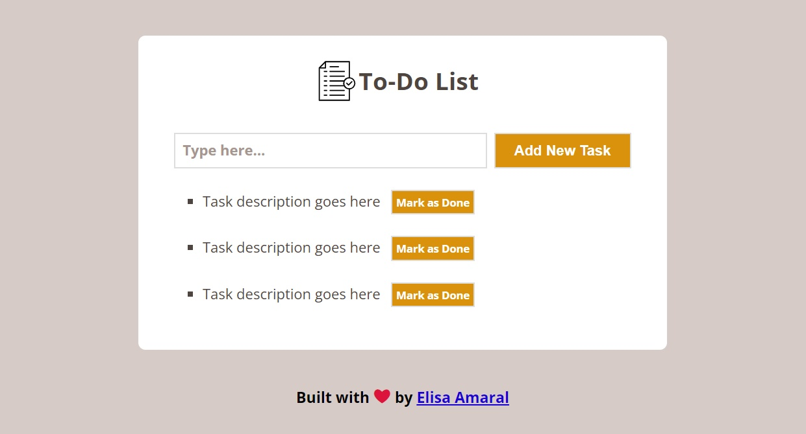

# To-Do List built with JavaScript

This project is a To-Do List, the user can add new tasks to the list and mark them as done after added. The browser's localStorage is used to store the added tasks and display them even after closing the browser. Basic responsive design styling was added to the project.

## Project Link

**coming soon**

## Screenshot

## Technology Stack

+ JavaScript
+ HTML
+ CSS
